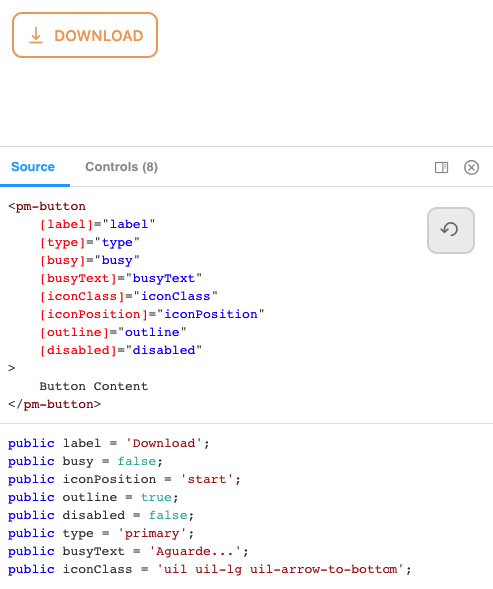
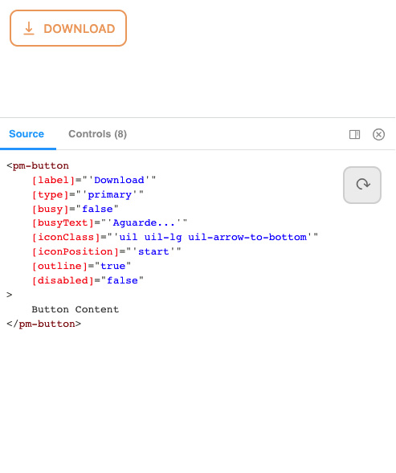

# Storybook ng-source Addon

Show your args evaluated on template or splitted into code/HTML.

Ideal for fast prototyping components and copy-paste based development.

Splitted Args (.HTML/.TS)             |  Evaluated Args (.HTML)
:-------------------------:|:-------------------------:
  |  

### Getting Started

Install into your project with `npm i storybook-ng-source-addon --save`

Add to your `main.js`, inside addons:

```
module.exports = {
  ...
  "addons": [
    "storybook-ng-source-addon",
    ...
  ],
  ...
}
```

### How to write stories for it to work

Stories should be written in the following format:

```
export const Template: Story<ButtonComponent> = (args) => ({
  props: args,
  template: `
    <pm-button
        [label]="label"
        [type]="type"
        [busy]="busy"
        [busyText]="busyText"
        [iconClass]="iconClass"
        [outline]="outline"
        [disabled]="disabled"
    >
        Button Content
    </pm-button>
  `
});

export const defaultArgs = {
  label: '',
  type: 'default',
  busy: false,
  busyText: '',
  iconClass: '',
  iconPosition: 'start',
  outline: false,
  disabled: false,
};

export const DefaultButton = Template.bind({});
DefaultButton.args = {
  ...defaultArgs
};
```


- should have only the variable `template` as multiline string using crasis (REQUIRED);
- should have variables inside double quotes (REQUIRED)

Then the plugin will do all the work :)
